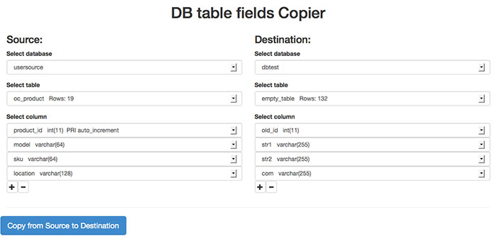
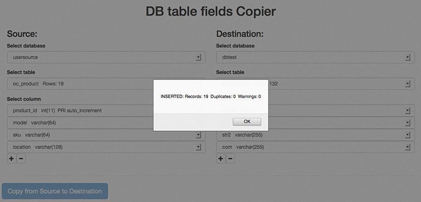

DB Copier
=========

One time I faced with problem to transfer data from one MySQL database to another that has absolutely different structures, but not data.
It was need to do it manually controlled, so I wrote this script to do it a bit easier.

<h4>How to use</h4>
1. Edit config.php with credential of DB user, that has privileges for both databases.
2. Choose source and destination DBs.
3. Choose source and destination tables.
4. Choose columns in tables you would like to transfer from one table to another. You should add the same quantity of rows with similar types.
5. Click Copy button. If data copied successfully you will get a message about how many records inserted, otherwise error description with SQL statement.

<h4>Discalimer</h4>
Script doesn't care about your input errors, SQL-injections or something like that, also you have to understand what you do and why. It's just simple interface for "copy-paste" data from one table to another, that encapsulates ordinary INSERT SELECT query.

<h4>Screenshots</h4>
  
